# ENTITY-RELATIONSHIP (ER) DIAGRAM & DATA ARCHITECTURE
## Hospital Appointment & Patient Care Management System (HAPCMS)

**Deliverable:** Review 1 (Week 7 — 5 Marks)  
**Notation:** Crow's Foot ER Notation & Relational Data Dictionary  
**Target RDBMS:** PostgreSQL (v14+)  

---

## 1. CONCEPTUAL ARCHITECTURE OVERVIEW

The database system is organized into **5 core functional clusters**:
1. **Provider & Roster Cluster:** `DEPARTMENT`, `DOCTOR`, `DOCTOR_SCHEDULE`
2. **Patient & Appointment Cluster:** `PATIENT`, `APPOINTMENT`
3. **Clinical Consultation & Care Cluster:** `CONSULTATION`, `DIAGNOSIS`, `PRESCRIPTION`, `PRESCRIPTION_ITEM`
4. **Diagnostics & Pathology Cluster:** `LAB_TEST`, `TEST_ORDER`
5. **Inpatient & Facility Cluster:** `WARD`, `BED`, `ADMISSION`
6. **Financial & Accounts Cluster:** `BILL`, `PAYMENT`

---

## 2. MERMAID ER DIAGRAM (CROW'S FOOT NOTATION)

```mermaid
erDiagram
    DEPARTMENT ||--o{ DOCTOR : "employs"
    DEPARTMENT ||--o{ WARD : "manages"
    DEPARTMENT ||--o{ LAB_TEST : "categorizes"
    
    DOCTOR ||--o{ DOCTOR_SCHEDULE : "maintains"
    DOCTOR ||--o{ APPOINTMENT : "scheduled_for"
    DOCTOR ||--o{ CONSULTATION : "conducts"
    DOCTOR ||--o{ ADMISSION : "admits"
    DOCTOR ||--o{ TEST_ORDER : "authorizes"
    DOCTOR ||--o{ PRESCRIPTION : "prescribes"
    
    PATIENT ||--o{ APPOINTMENT : "books"
    PATIENT ||--o{ CONSULTATION : "participates_in"
    PATIENT ||--o{ ADMISSION : "admitted_to"
    PATIENT ||--o{ TEST_ORDER : "undergoes"
    PATIENT ||--o{ PRESCRIPTION : "receives"
    PATIENT ||--o{ BILL : "incurred_by"
    
    APPOINTMENT ||--o| CONSULTATION : "initiates"
    APPOINTMENT ||--o| BILL : "generates_op_bill"
    
    CONSULTATION ||--o{ DIAGNOSIS : "determines"
    CONSULTATION ||--o{ PRESCRIPTION : "issues"
    CONSULTATION ||--o{ TEST_ORDER : "requests"
    
    PRESCRIPTION ||--|{ PRESCRIPTION_ITEM : "contains"
    
    LAB_TEST ||--o{ TEST_ORDER : "specifies"
    
    WARD ||--|{ BED : "houses"
    BED ||--o{ ADMISSION : "assigned_during"
    ADMISSION ||--o| BILL : "generates_ip_bill"
    
    BILL ||--o{ PAYMENT : "settled_via"

    DEPARTMENT {
        int department_id PK "Serial Identifier"
        varchar department_name "Unique Department Name"
        varchar building_floor "Building & Floor Location"
        varchar head_of_department "Lead Physician/HOD"
        varchar contact_phone "Department Extension/Phone"
    }

    DOCTOR {
        int doctor_id PK "Serial Identifier"
        int department_id FK "References DEPARTMENT"
        varchar first_name "Doctor First Name"
        varchar last_name "Doctor Last Name"
        varchar specialization "Clinical Specialization"
        varchar license_number "Unique Medical License"
        numeric consultation_fee "Fee per Consultation"
        varchar phone "Contact Mobile Number"
        varchar email "Professional Email"
        boolean is_active "Employment Status"
    }

    DOCTOR_SCHEDULE {
        int schedule_id PK "Serial Identifier"
        int doctor_id FK "References DOCTOR"
        varchar day_of_week "Monday - Sunday"
        time start_time "Shift Start Time"
        time end_time "Shift End Time"
        int slot_duration_minutes "Duration per Patient (mins)"
        int max_patients "Max Booking Threshold"
    }

    PATIENT {
        int patient_id PK "Serial Identifier"
        varchar first_name "Patient First Name"
        varchar last_name "Patient Last Name"
        date date_of_birth "DOB"
        varchar gender "M, F, Other"
        varchar blood_group "A+, A-, B+, B-, AB+, AB-, O+, O-"
        varchar phone "Unique Mobile Number"
        varchar email "Unique Email Address"
        text address "Residential Address"
        varchar emergency_contact_name "Next of Kin Name"
        varchar emergency_contact_phone "Next of Kin Contact"
        timestamp created_at "Registration Timestamp"
    }

    APPOINTMENT {
        int appointment_id PK "Serial Identifier"
        int patient_id FK "References PATIENT"
        int doctor_id FK "References DOCTOR"
        date appointment_date "Scheduled Date"
        time appointment_time "Scheduled Time Slot"
        varchar status "SCHEDULED, CHECKED_IN, COMPLETED, CANCELLED, NO_SHOW"
        varchar appointment_type "NEW_VISIT, FOLLOW_UP, EMERGENCY"
        text reason_for_visit "Primary Complaint"
        text cancellation_reason "Reason if Cancelled"
    }

    CONSULTATION {
        int consultation_id PK "Serial Identifier"
        int appointment_id FK "References APPOINTMENT (UNIQUE)"
        int patient_id FK "References PATIENT"
        int doctor_id FK "References DOCTOR"
        timestamp consultation_timestamp "Encounter Timestamp"
        text symptoms "Clinical Symptoms"
        text clinical_notes "Examination Findings"
        varchar blood_pressure "e.g., 120/80 mmHg"
        int heart_rate "BPM"
        numeric temperature_celsius "Body Temp in °C"
        numeric spo2_percent "Oxygen Saturation %"
        date follow_up_date "Recommended Review Date"
    }

    DIAGNOSIS {
        int diagnosis_id PK "Serial Identifier"
        int consultation_id FK "References CONSULTATION"
        varchar icd_code "Standardized ICD-10 Code"
        varchar diagnosis_name "Clinical Diagnosis Title"
        varchar diagnosis_type "PRIMARY, SECONDARY, PROVISIONAL, CONFIRMED"
        text remarks "Clinical Assessment Remarks"
    }

    PRESCRIPTION {
        int prescription_id PK "Serial Identifier"
        int consultation_id FK "References CONSULTATION"
        int patient_id FK "References PATIENT"
        int doctor_id FK "References DOCTOR"
        date issue_date "Date Prescribed"
        text special_instructions "General Dietary/Care Advice"
    }

    PRESCRIPTION_ITEM {
        int item_id PK "Serial Identifier"
        int prescription_id FK "References PRESCRIPTION"
        varchar medicine_name "Generic/Brand Drug Name"
        varchar dosage_form "Tablet, Capsule, Syrup, Injection"
        varchar strength "e.g., 500mg, 10ml"
        varchar frequency "e.g., 1-0-1, 1-1-1, PRN"
        int duration_days "Course Duration in Days"
        varchar route "Oral, IV, IM, Topical"
        text instructions "Before/After Meals, Special Cautions"
    }

    LAB_TEST {
        int test_id PK "Serial Identifier"
        int department_id FK "References DEPARTMENT"
        varchar test_name "Laboratory Investigation Title"
        varchar test_code "Unique Test Code (e.g. CBC-01)"
        varchar test_category "Biochemistry, Pathology, Radiology, etc."
        numeric standard_price "Standard Charge in Currency"
        varchar sample_type "Blood, Urine, Sputum, Swab, Imaging"
        text normal_range "Standard Biological Reference Range"
        int turnaround_hours "Expected SLA Hours"
    }

    TEST_ORDER {
        int order_id PK "Serial Identifier"
        int consultation_id FK "References CONSULTATION"
        int patient_id FK "References PATIENT"
        int test_id FK "References LAB_TEST"
        int ordered_by_doctor_id FK "References DOCTOR"
        timestamp order_date "Timestamp Ordered"
        timestamp sample_collected_date "Timestamp Sample Taken"
        timestamp result_date "Timestamp Lab Verification"
        text test_result "Observed Qualitative/Quantitative Result"
        text reference_range_observed "Observed Range Reference"
        varchar abnormal_flag "NORMAL, ABNORMAL, CRITICAL, PENDING"
        text technician_remarks "Pathologist Comments"
        varchar order_status "ORDERED, SAMPLE_COLLECTED, ANALYZING, COMPLETED, CANCELLED"
    }

    WARD {
        int ward_id PK "Serial Identifier"
        int department_id FK "References DEPARTMENT"
        varchar ward_name "Ward Identifier Name"
        varchar ward_type "GENERAL, SEMI_PRIVATE, PRIVATE, ICU, CCU, EMERGENCY"
        int floor_number "Floor Level"
        numeric daily_rate "Per-Diem Room Charge"
        int total_beds "Total Bed Capacity"
    }

    BED {
        int bed_id PK "Serial Identifier"
        int ward_id FK "References WARD"
        varchar bed_number "Unique Bed Number within Ward"
        varchar status "AVAILABLE, OCCUPIED, MAINTENANCE, RESERVED"
        boolean is_active "Operational Status"
    }

    ADMISSION {
        int admission_id PK "Serial Identifier"
        int patient_id FK "References PATIENT"
        int admitting_doctor_id FK "References DOCTOR"
        int bed_id FK "References BED"
        timestamp admission_date "Admission Timestamp"
        timestamp discharge_date "Discharge Timestamp (Nullable)"
        text admission_reason "Clinical Indication for Inpatient Care"
        text discharge_summary "Summary of Care upon Discharge"
        varchar status "ADMITTED, DISCHARGED, TRANSFERRED"
    }

    BILL {
        int bill_id PK "Serial Identifier"
        int patient_id FK "References PATIENT"
        int appointment_id FK "Nullable FK to APPOINTMENT"
        int admission_id FK "Nullable FK to ADMISSION"
        date bill_date "Invoice Date"
        numeric consultation_charges "Consultation Subtotal"
        numeric test_charges "Laboratory Tests Subtotal"
        numeric bed_charges "Inpatient Stay Subtotal"
        numeric pharmacy_charges "Medications Subtotal"
        numeric other_charges "Nursing & Sundry Charges"
        numeric discount_amount "Applicable Discount"
        numeric tax_amount "Applicable GST/VAT"
        numeric total_amount "Net Payable Invoiced Amount"
        varchar payment_status "PENDING, PARTIALLY_PAID, PAID, REFUNDED, CANCELLED"
    }

    PAYMENT {
        int payment_id PK "Serial Identifier"
        int bill_id FK "References BILL"
        timestamp payment_timestamp "Transaction Timestamp"
        numeric amount_paid "Amount Tendered"
        varchar payment_method "CASH, CREDIT_CARD, DEBIT_CARD, UPI, NET_BANKING, INSURANCE"
        varchar transaction_reference "Bank/Gateway Ref / Receipt #"
        text notes "Payment Notes"
    }
```



---

## 3. CARDINALITY & STRUCTURAL PARTICIPATION

```
┌───────────────────────┬──────────────┬───────────────────────┬─────────────┬──────────────┐
│ Entity 1              │ Relationship │ Entity 2              │ Cardinality │ Modality     │
├───────────────────────┼──────────────┼───────────────────────┼─────────────┼──────────────┤
│ DEPARTMENT            │ Employs      │ DOCTOR                │ 1 : N       │ Mandatory (1)│
│ DOCTOR                │ Maintains    │ DOCTOR_SCHEDULE       │ 1 : N       │ Optional (0) │
│ DOCTOR                │ Attends      │ APPOINTMENT           │ 1 : N       │ Optional (0) │
│ PATIENT               │ Books        │ APPOINTMENT           │ 1 : N       │ Optional (0) │
│ APPOINTMENT           │ Results In   │ CONSULTATION          │ 1 : 1 (0..1)│ Optional (0) │
│ CONSULTATION          │ Identifies   │ DIAGNOSIS             │ 1 : N       │ Optional (0) │
│ CONSULTATION          │ Issues       │ PRESCRIPTION          │ 1 : N       │ Optional (0) │
│ PRESCRIPTION          │ Contains     │ PRESCRIPTION_ITEM     │ 1 : N       │ Mandatory (1)│
│ CONSULTATION          │ Requests     │ TEST_ORDER            │ 1 : N       │ Optional (0) │
│ LAB_TEST              │ Defined In   │ TEST_ORDER            │ 1 : N       │ Optional (0) │
│ WARD                  │ Contains     │ BED                   │ 1 : N       │ Mandatory (1)│
│ BED                   │ Allocated In │ ADMISSION             │ 1 : N       │ Optional (0) │
│ PATIENT               │ Admitted As  │ ADMISSION             │ 1 : N       │ Optional (0) │
│ PATIENT               │ Receives     │ BILL                  │ 1 : N       │ Optional (0) │
│ APPOINTMENT           │ Invoiced In  │ BILL                  │ 1 : 1 (0..1)│ Optional (0) │
│ ADMISSION             │ Invoiced In  │ BILL                  │ 1 : 1 (0..1)│ Optional (0) │
│ BILL                  │ Settled In   │ PAYMENT               │ 1 : N       │ Optional (0) │
└───────────────────────┴──────────────┴───────────────────────┴─────────────┴──────────────┘
```

---

## 4. RELATIONAL ENTITY MAPPING & FOREIGN KEY DEPENDENCY TREE

The diagram below outlines the foreign key creation hierarchy to guarantee zero dependency cycles during database instantiation:

```text
Level 0 (Independent Master Tables):
  └── DEPARTMENT
  └── PATIENT

Level 1 (Direct Dependents):
  ├── DOCTOR (depends on DEPARTMENT)
  ├── WARD (depends on DEPARTMENT)
  └── LAB_TEST (depends on DEPARTMENT)

Level 2 (Secondary Dependents):
  ├── DOCTOR_SCHEDULE (depends on DOCTOR)
  ├── BED (depends on WARD)
  └── APPOINTMENT (depends on PATIENT, DOCTOR)

Level 3 (Clinical Encounters & Inpatient Admissions):
  ├── CONSULTATION (depends on APPOINTMENT, PATIENT, DOCTOR)
  └── ADMISSION (depends on PATIENT, DOCTOR, BED)

Level 4 (Care Orders & Prescriptions):
  ├── DIAGNOSIS (depends on CONSULTATION)
  ├── PRESCRIPTION (depends on CONSULTATION, PATIENT, DOCTOR)
  ├── TEST_ORDER (depends on CONSULTATION, PATIENT, LAB_TEST, DOCTOR)
  └── BILL (depends on PATIENT, APPOINTMENT [opt], ADMISSION [opt])

Level 5 (Line Items & Settlements):
  ├── PRESCRIPTION_ITEM (depends on PRESCRIPTION)
  └── PAYMENT (depends on BILL)
```
