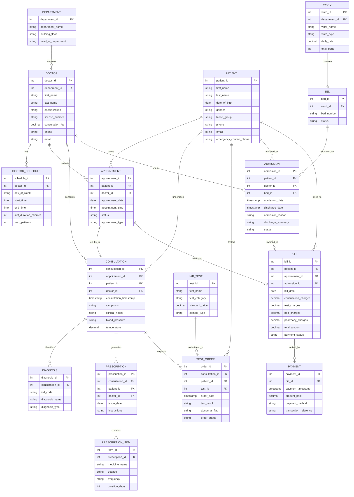

# DATABASE MANAGEMENT SYSTEM PROJECT REPORT
## REVIEW 1 — CONCEPTUAL DESIGN & RELATIONAL SCHEMA

**Project Title:** Hospital Appointment and Patient Care Management System (HAPCMS)  
**Deliverable:** Review 1 (Week 7 — 5 Marks)  
**Target RDBMS:** PostgreSQL (v14+)  
**Domain:** Healthcare Information Systems & Clinical Relational Databases  

---

## TABLE OF CONTENTS
1. [Problem Identification & Background](#1-problem-identification--background)
2. [Project Scope & Objectives](#2-project-scope--objectives)
3. [User Stakeholder Roles & Access Matrix](#3-user-stakeholder-roles--access-matrix)
4. [Functional Requirements Specification](#4-functional-requirements-specification)
5. [Non-Functional Requirements & Business Integrity Rules](#5-non-functional-requirements--business-integrity-rules)
6. [Conceptual Design & Entity-Relationship (ER) Modeling](#6-conceptual-design--entity-relationship-er-modeling)
7. [Relational Schema & 3NF Normalization Analysis](#7-relational-schema--3nf-normalization-analysis)
8. [Relational Data Dictionary & Schema Constraints](#8-relational-data-dictionary--schema-constraints)
9. [Review 2 & 3 Roadmap (Implementation & Front-End)](#9-review-2--3-roadmap)

---

## 1. PROBLEM IDENTIFICATION & BACKGROUND

### 1.1 Background
Modern healthcare facilities operate in high-tempo, multi-disciplinary environments encompassing outpatient consultations, emergency triage, diagnostic laboratories, pharmacy dispensaries, inpatient wards, and accounts departments. A single patient journey often intersects dozens of hospital touchpoints over time.

### 1.2 Identified Problems in Conventional / Disconnected Systems
Manual, paper-driven, or siloed legacy database systems suffer from fundamental structural failures:
1. **Schedule Collisions & Double-Booking:** Lack of real-time transactional concurrency controls allows multiple patients to be booked for the same doctor in the same time slot, leading to long waiting times and doctor burnout.
2. **Fragmented & Inaccessible Patient Records:** Clinical history, past diagnoses, previous prescriptions, and laboratory test results are stored across disconnected files. Clinicians cannot access a unified longitudinal patient chart at the point of care.
3. **Bed Allocation Bottlenecks & Overlapping Admissions:** Inpatient bed management lacks real-time state tracking, causing double-allocations of ward beds, delayed admissions, and unrecorded bed vacancies.
4. **Uncoordinated Diagnostic & Pharmacy Orders:** Prescriptions and lab orders written during consultations are often lost or incorrectly linked to patient invoices, leading to revenue leakage and medication dispensation errors.
5. **Billing Inconsistencies & Revenue Leakage:** Fragmented billing modules fail to aggregate doctor consultation fees, diagnostic test charges, bed per-diem tariffs, and medication costs into a coherent, itemized invoice with clear payment audit trails.

### 1.3 Motivation for a Unified Relational Database
A well-architected Relational Database Management System (RDBMS) built on PostgreSQL provides:
- **ACID Transactions:** Ensuring atomic appointment bookings, bed occupancy transitions, and payment recording.
- **Relational Integrity:** Enforcing strict foreign keys, domain constraints, unique indexes, and temporal validations.
- **Normalized Architecture (3NF):** Eliminating data anomalies (insert, update, delete) and data redundancy.
- **Scalable Query Performance:** Enabling rapid cross-departmental analytics, patient history aggregation, and bed occupancy reporting.

---

## 2. PROJECT SCOPE & OBJECTIVES

### 2.1 Project Objectives (SMART)
- **Specific:** Design and implement a normalized (3NF) relational database for outpatient appointments, clinical consultations, diagnoses, electronic prescriptions, lab tests, inpatient ward/bed allocation, and billing.
- **Measurable:** Support zero-collision appointment booking, 100% exclusive bed allocation, exact charge-payment reconciliation, and sub-second multi-table relational joins.
- **Achievable:** Implement robust DDL in PostgreSQL with comprehensive integrity constraints (PRIMARY KEY, FOREIGN KEY, CHECK, UNIQUE, NOT NULL, DEFAULT).
- **Relevant:** Eliminate operational hospital bottlenecks and provide clinical and administrative decision-makers with real-time reporting views.
- **Time-bound:** Complete Review 1 (Conceptual Design & Relational Schema by Week 7), Review 2 (Advanced SQL, Views, Triggers, Optimization by Week 10), and Review 3 (Full Application & Testing by Week 12).

### 2.2 System Scope
```
┌─────────────────────────────────────────────────────────────────────────────┐
│                            SYSTEM BOUNDARY (HAPCMS)                         │
├─────────────────────────────────────────────────────────────────────────────┤
│  IN-SCOPE MODULES:                                                          │
│  ├── 1. Patient Demographics & Registration Subsystem                       │
│  ├── 2. Department & Doctor Roster Subsystem                                │
│  ├── 3. Outpatient Appointment Booking & Queue Management Subsystem         │
│  ├── 4. Electronic Clinical Consultation, Diagnoses & Prescription Subsystem │
│  ├── 5. Diagnostic Laboratory Test Ordering & Result Reporting Subsystem     │
│  ├── 6. Inpatient Ward Admission & Bed Occupancy Management Subsystem       │
│  └── 7. Consolidated Billing, Invoicing & Multi-Method Payment Subsystem    │
├─────────────────────────────────────────────────────────────────────────────┤
│  OUT-OF-SCOPE:                                                              │
│  ├── Hardware IoT telemetry streams (real-time ECG/ICU monitors)            │
│  ├── Hospital staff human resources payroll and leave management            │
│  ├── High-volume DICOM medical image binary raw storage (PACS engine)       │
└─────────────────────────────────────────────────────────────────────────────┘
```

---

## 3. USER STAKEHOLDER ROLES & ACCESS MATRIX

The system defines 7 primary user roles with distinct operational responsibilities and CRUD privileges:

| Role | Operational Scope | Key System Functions | Access Permissions |
| :--- | :--- | :--- | :--- |
| **Patient** | Self-Service / Outpatient | View doctors, view available slots, book/cancel appointments, view own medical history, download prescriptions and bills. | Read (Own Records), Create (Appointments) |
| **Doctor / Specialist** | Clinical Care | View daily roster, view appointment queue, record consultation findings, assign diagnoses, write electronic prescriptions, order lab tests, recommend admission. | Read/Write (Consultations, Diagnoses, Prescriptions, Lab Orders) |
| **Desk Receptionist / Clerk** | Front-Desk Operations | Register new patients, book/reschedule appointments, check-in arriving patients, initiate outpatient billing requests. | Read/Write (Patients, Appointments), Read (Doctors, Schedules) |
| **Ward Nurse / Staff** | Inpatient Care | View bed occupancy, update patient admission vitals, record bed discharge readiness, view patient test statuses. | Read/Write (Admissions, Bed Status), Read (Patients, Prescriptions) |
| **Lab Technician / Pathologist** | Diagnostic Laboratory | View ordered lab tests, enter test results, mark tests as 'Sample Collected', 'In-Progress', or 'Completed'. | Read (Test Orders), Read/Write (Test Results) |
| **Billing & Accounts Officer** | Financial Operations | Generate consolidated bills (consultation + tests + bed charges), process payments (Cash, Card, UPI, Insurance), issue payment receipts, monitor unpaid dues. | Read/Write (Bills, Payments), Read (All billable service tables) |
| **Hospital Administrator** | Management & Audit | Manage medical departments, doctor credentials, duty schedules, ward/bed configurations, system audit logs, and operational reports. | Full System Access (CRUD on all administrative master tables) |

---

## 4. FUNCTIONAL REQUIREMENTS SPECIFICATION

### FR-1: Patient Registration & Profile Management
- **FR-1.1:** System shall capture unique patient demographics (Full Name, Date of Birth, Gender, Blood Group, Contact Number, Email, Residential Address, Emergency Contact Person & Phone).
- **FR-1.2:** System shall assign an immutable unique identifier (`patient_id`) upon registration.
- **FR-1.3:** Contact number and Email must be uniquely indexed to prevent duplicate patient profiles.

### FR-2: Department & Doctor Roster Management
- **FR-2.1:** System shall organize medical services into distinct Clinical Departments (e.g., Cardiology, Neurology, Orthopedics, Pediatrics, Oncology, General Medicine).
- **FR-2.2:** System shall maintain Doctor credentials, specialization, department affiliation, consultation fee, license number, contact details, and active employment status.
- **FR-2.3:** System shall maintain recurring and ad-hoc Doctor Schedules specifying available days of the week, start times, end times, slot durations (e.g., 15 or 30 minutes), and maximum patient capacities.

### FR-3: Outpatient Appointment Booking & Scheduling
- **FR-3.1:** System shall allow patients or receptionists to schedule appointments for an active doctor on a valid future date and within the doctor's scheduled working hours.
- **FR-3.2:** System shall automatically prevent slot collisions (a doctor cannot have two scheduled appointments overlapping in the same time window).
- **FR-3.3:** System shall track appointment lifecycle statuses: `SCHEDULED`, `CONFIRMED`, `CHECKED_IN`, `IN_CONSULTATION`, `COMPLETED`, `CANCELLED`, `NO_SHOW`.
- **FR-3.4:** System shall require a cancellation reason if an appointment is cancelled.

### FR-4: Clinical Consultation, Diagnoses & Electronic Prescriptions
- **FR-4.1:** System shall record an official clinical consultation record linked directly to a completed/active appointment.
- **FR-4.2:** System shall allow the attending doctor to record chief complaints, clinical examination notes, vitals (BP, Heart Rate, Temperature, SpO2), and doctor's advice.
- **FR-4.3:** System shall allow multiple standardized diagnoses (ICD code, diagnosis description, diagnosis type: `PRIMARY`, `SECONDARY`, `PROVISIONAL`, `CONFIRMED`) per consultation.
- **FR-4.4:** System shall support multi-item electronic prescriptions detailing medication name, dosage form (Tablet, Syrup, Injection), strength (e.g., 500mg), frequency (e.g., 1-0-1), duration in days, administration instructions, and doctor remarks.

### FR-5: Diagnostic & Laboratory Test Workflow
- **FR-5.1:** System shall maintain a master catalog of available Diagnostic Tests (Test Name, Department/Lab Category, Standard Cost, Sample Type required, Normal Reference Range).
- **FR-5.2:** Doctors can order one or more diagnostic tests during a consultation.
- **FR-5.3:** System shall track test order status (`ORDERED`, `SAMPLE_COLLECTED`, `ANALYZING`, `COMPLETED`, `CANCELLED`).
- **FR-5.4:** Pathologists/Technicians shall record quantitative/qualitative test results, reference range comparison, abnormal flag (`NORMAL`, `ABNORMAL`, `CRITICAL`), and pathologist sign-off timestamp.

### FR-6: Inpatient Admission & Bed Allocation Management
- **FR-6.1:** System shall maintain Hospital Wards categorized by type (`GENERAL`, `SEMI_PRIVATE`, `PRIVATE`, `ICU`, `CCU`, `EMERGENCY`) with assigned daily room rates.
- **FR-6.2:** System shall maintain individual Beds within each ward with physical numbers and real-time statuses (`AVAILABLE`, `OCCUPIED`, `MAINTENANCE`, `RESERVED`).
- **FR-6.3:** System shall record patient admissions including admitting doctor, admission reason, admission date/time, allocated bed, discharge date/time, discharge summary, and admission status (`ADMITTED`, `DISCHARGED`, `TRANSFERRED`).
- **FR-6.4:** Bed status must automatically transition to `OCCUPIED` upon active admission and return to `AVAILABLE` (or `MAINTENANCE`) upon discharge.

### FR-7: Consolidated Billing & Payment Processing
- **FR-7.1:** System shall generate consolidated invoices aggregating:
  - Doctor Consultation Fees
  - Ordered Diagnostic & Lab Test Fees
  - Inpatient Bed Per-Diem Charges (Calculated as: `Days Admitted × Daily Bed Rate`)
  - Pharmacy & Miscellaneous Medical Supplies
- **FR-7.2:** System shall compute subtotal, tax amount, discount amount, and net payable amount.
- **FR-7.3:** System shall record multi-tender payments (Cash, Credit Card, Debit Card, UPI / Net Banking, Health Insurance TPA) against bills.
- **FR-7.4:** System shall maintain bill payment statuses: `PENDING`, `PARTIALLY_PAID`, `PAID`, `REFUNDED`, `CANCELLED`.
- **FR-7.5:** Total payments made against a bill cannot exceed the net total bill amount.

---

## 5. NON-FUNCTIONAL REQUIREMENTS & BUSINESS INTEGRITY RULES

### 5.1 Non-Functional Requirements (NFR)
- **Data Integrity & Consistency:** Fully ACID-compliant transaction boundaries in PostgreSQL. No orphan records permitted via enforced Foreign Key constraints.
- **Performance & Indexing:** Primary keys, foreign keys, and frequently filtered fields (`appointment_date`, `patient_id`, `doctor_id`, `status`, `phone`) indexed with B-Tree indexes to ensure queries resolve in $< 50\text{ ms}$.
- **Security & Confidentiality:** Patient Medical Records (EMR) must enforce role-based segregation. Sensitive columns protected against unauthorized mutation.
- **Extensibility:** Schema adheres strictly to Third Normal Form (3NF), enabling seamless integration of future modules (e.g., Blood Bank, Ambulance Dispatch, Operation Theatre Scheduling).

### 5.2 Core Business Rules (Integrity Constraints)

```
┌─────────────────────────────────────────────────────────────────────────────┐
│                           CORE BUSINESS RULES MATRIX                        │
├──────┬───────────────────────────┬──────────────────────────────────────────┤
│ ID   │ Business Rule Description │ Database Enforcement Mechanism           │
├──────┼───────────────────────────┼──────────────────────────────────────────┤
│ BR-1 │ No Overlapping Doctor     │ UNIQUE constraint on                     │
│      │ Appointments              │ (doctor_id, appointment_date, time_slot) │
│      │                           │ + PostgreSQL EXCLUDE / CHECK constraint. │
├──────┼───────────────────────────┼──────────────────────────────────────────┤
│ BR-2 │ Single Active Patient     │ Bed status constraint; Admission check:  │
│      │ Per Bed                   │ Only 'AVAILABLE' beds can be allocated;  │
│      │                           │ Bed marked 'OCCUPIED' during stay.       │
├──────┼───────────────────────────┼──────────────────────────────────────────┤
│ BR-3 │ Chronological Validity of │ CHECK (discharge_date IS NULL OR         │
│      │ Admission & Discharge     │ discharge_date >= admission_date)        │
├──────┼───────────────────────────┼──────────────────────────────────────────┤
│ BR-4 │ Positive Financials       │ CHECK (unit_price >= 0),                 │
│      │ & Non-Negative Balance    │ CHECK (total_amount >= 0),               │
│      │                           │ CHECK (paid_amount <= total_amount)      │
├──────┼───────────────────────────┼──────────────────────────────────────────┤
│ BR-5 │ Prescription & Test Order │ NOT NULL Foreign Keys linking to active  │
│      │ Traceability              │ consultation_id and doctor_id.           │
├──────┼───────────────────────────┼──────────────────────────────────────────┤
│ BR-6 │ Valid Biological Bounds   │ CHECK (dob <= CURRENT_DATE),             │
│      │                           │ CHECK (gender IN ('M','F','Other')),     │
│      │                           │ CHECK (blood_group IN ('A+','A-',...))   │
└──────┴───────────────────────────┴──────────────────────────────────────────┘
```

---

## 6. CONCEPTUAL DESIGN & ENTITY-RELATIONSHIP (ER) MODELING

### 6.1 Identification of Principal Entities
The conceptual data model identifies **16 principal and associative entities**:

1. **`DEPARTMENT`**: Medical divisions (e.g. Cardiology, Neurology) managing clinical doctors.
2. **`DOCTOR`**: Medical specialists providing consultation, treatment, and admission oversight.
3. **`DOCTOR_SCHEDULE`**: Doctor availability rosters specifying active days, shift hours, and slot intervals.
4. **`PATIENT`**: Master entity containing demographic, medical, and emergency contact information.
5. **`APPOINTMENT`**: Scheduled outpatient encounters between a patient and a doctor.
6. **`CONSULTATION`**: Clinical encounter record capturing vitals, physical findings, and doctor's notes.
7. **`DIAGNOSIS`**: Specific clinical conditions and ICD codes assigned during a consultation.
8. **`PRESCRIPTION`**: Header entity representing an electronic medication order issued by a doctor.
9. **`PRESCRIPTION_ITEM`**: Line-item entity capturing individual drugs, dosages, frequencies, and durations.
10. **`LAB_TEST`**: Master catalog of diagnostic laboratory and imaging tests with standard pricing.
11. **`TEST_ORDER`**: Ordered laboratory test instance linked to a patient, doctor, and consultation.
12. **`WARD`**: Hospital inpatient physical divisions categorized by care level and base tariff.
13. **`BED`**: Specific bed unit within a ward with real-time occupancy status.
14. **`ADMISSION`**: Inpatient stay record capturing admission timing, reason, bed allocation, and discharge.
15. **`BILL`**: Financial invoice aggregating consultation, lab, admission, and pharmacy charges.
16. **`PAYMENT`**: Transactional receipt capturing monetary payments made towards a bill.

---

### 6.2 Entity-Relationship (ER) Diagram (Crow's Foot Notation)



---

### 6.3 Cardinality & Relationship Breakdown

| Parent Entity | Relationship | Child Entity | Cardinality | Business Semantics |
| :--- | :---: | :--- | :---: | :--- |
| `DEPARTMENT` | Employs | `DOCTOR` | $1 : N$ | A department employs one or many doctors; each doctor belongs to exactly one department. |
| `DOCTOR` | Holds | `DOCTOR_SCHEDULE` | $1 : N$ | A doctor has one or multiple recurring duty schedule slots across days of the week. |
| `DOCTOR` | Attends | `APPOINTMENT` | $1 : N$ | A doctor attends many patient appointments; each appointment is for exactly one doctor. |
| `PATIENT` | Books | `APPOINTMENT` | $1 : N$ | A patient can book multiple appointments over time; an appointment belongs to one patient. |
| `APPOINTMENT` | Generates | `CONSULTATION` | $1 : (0..1)$ | An appointment leads to at most one clinical consultation encounter. |
| `CONSULTATION` | Identifies | `DIAGNOSIS` | $1 : N$ | A consultation can yield one or multiple clinical diagnoses/ICD codes. |
| `CONSULTATION` | Issues | `PRESCRIPTION` | $1 : N$ | A consultation can result in one or more prescription headers. |
| `PRESCRIPTION` | Comprises | `PRESCRIPTION_ITEM` | $1 : N$ | A prescription header contains one or many individual medicine line-items. |
| `CONSULTATION` | Orders | `TEST_ORDER` | $1 : N$ | A doctor during consultation orders zero, one, or multiple diagnostic lab tests. |
| `LAB_TEST` | Catalog For | `TEST_ORDER` | $1 : N$ | A catalog lab test can be ordered across multiple patient clinical test orders. |
| `WARD` | Contains | `BED` | $1 : N$ | A hospital ward contains multiple physical beds. |
| `BED` | Accommodates | `ADMISSION` | $1 : N$ | A bed can have many historical admissions over time, but only one active admission at any given moment. |
| `PATIENT` | Undergoes | `ADMISSION` | $1 : N$ | A patient can have multiple inpatient hospital admissions over their lifetime. |
| `PATIENT` | Incurred By | `BILL` | $1 : N$ | A patient can receive multiple bills for outpatient or inpatient episodes. |
| `BILL` | Settled By | `PAYMENT` | $1 : N$ | A bill can be settled in full with one payment or in installments via multiple payments. |

---

## 7. RELATIONAL SCHEMA & 3NF NORMALIZATION ANALYSIS

### 7.1 Formal Relational Schema Definition
The normalized relational schema is represented in relational algebra notation:

```text
DEPARTMENT (department_id [PK], department_name, building_floor, head_of_department, contact_phone)

DOCTOR (doctor_id [PK], department_id [FK], first_name, last_name, specialization, license_number, consultation_fee, phone, email, is_active)

DOCTOR_SCHEDULE (schedule_id [PK], doctor_id [FK], day_of_week, start_time, end_time, slot_duration_minutes, max_patients)

PATIENT (patient_id [PK], first_name, last_name, date_of_birth, gender, blood_group, phone, email, address, emergency_contact_name, emergency_contact_phone, created_at)

APPOINTMENT (appointment_id [PK], patient_id [FK], doctor_id [FK], appointment_date, appointment_time, status, appointment_type, reason_for_visit, cancellation_reason)

CONSULTATION (consultation_id [PK], appointment_id [FK, UNIQUE], patient_id [FK], doctor_id [FK], consultation_timestamp, symptoms, clinical_notes, blood_pressure, heart_rate, temperature_celsius, spo2_percent, follow_up_date)

DIAGNOSIS (diagnosis_id [PK], consultation_id [FK], icd_code, diagnosis_name, diagnosis_type, remarks)

PRESCRIPTION (prescription_id [PK], consultation_id [FK], patient_id [FK], doctor_id [FK], issue_date, special_instructions)

PRESCRIPTION_ITEM (item_id [PK], prescription_id [FK], medicine_name, dosage_form, strength, frequency, duration_days, route, instructions)

LAB_TEST (test_id [PK], department_id [FK], test_name, test_code, test_category, standard_price, sample_type, normal_range, turnaround_hours)

TEST_ORDER (order_id [PK], consultation_id [FK], patient_id [FK], test_id [FK], ordered_by_doctor_id [FK], order_date, sample_collected_date, result_date, test_result, reference_range_observed, abnormal_flag, technician_remarks, order_status)

WARD (ward_id [PK], department_id [FK], ward_name, ward_type, floor_number, daily_rate, total_beds)

BED (bed_id [PK], ward_id [FK], bed_number, status, is_active)

ADMISSION (admission_id [PK], patient_id [FK], admitting_doctor_id [FK], bed_id [FK], admission_date, discharge_date, admission_reason, discharge_summary, status)

BILL (bill_id [PK], patient_id [FK], appointment_id [FK, NULLABLE], admission_id [FK, NULLABLE], bill_date, consultation_charges, test_charges, bed_charges, pharmacy_charges, other_charges, discount_amount, tax_amount, total_amount, payment_status)

PAYMENT (payment_id [PK], bill_id [FK], payment_timestamp, amount_paid, payment_method, transaction_reference, notes)
```

---

### 7.2 Step-by-Step Normalization Breakdown (UNF $\to$ 1NF $\to$ 2NF $\to$ 3NF)

#### Step 1: Unnormalized Form (UNF)
In a manual hospital record or flat spreadsheet, a single record contains multi-valued attributes and repeating groups:
$$\text{UNF} = \{ \text{PatientName, DoctorName, DeptName, ApptDate, Symptoms, Diagnoses(1..n), Medicines(1..n), Tests(1..n), Ward, Bed, TotalBill, Payments(1..n)} \}$$
- **Issues:** Repeating groups for medicines, tests, and payments; massive data duplication; high update/delete anomalies.

#### Step 2: First Normal Form (1NF)
- **Requirement:** All attributes must contain atomic (indivisible) scalar values. No repeating groups or multi-valued arrays. Each relation must have a designated Primary Key.
- **Transformation:**
  - Decomposed repeating medicine groups into discrete `PRESCRIPTION_ITEM` rows.
  - Decomposed multi-valued diagnostic test orders into `TEST_ORDER` rows.
  - Decomposed multi-tender payments into `PAYMENT` rows.
  - Split compound names into `first_name` and `last_name`.
  - Defined synthetic unique surrogate integer Primary Keys (`id` series) for all relations.

#### Step 3: Second Normal Form (2NF)
- **Requirement:** Relation must be in 1NF and have **no partial functional dependencies** (no non-prime attribute may depend on a proper subset of any composite candidate key).
- **Transformation:**
  - All entities utilize atomic Single-Attribute Primary Keys (e.g. `patient_id`, `doctor_id`, `consultation_id`).
  - In associative entities like `PRESCRIPTION_ITEM`, the primary key is `item_id`, and `prescription_id` is a foreign key. The medicine details depend on the entire key (`item_id`), not partially on `prescription_id`.
  - Therefore, because there are **no composite candidate keys with partial dependencies**, every relation is strictly in **2NF**.

#### Step 4: Third Normal Form (3NF)
- **Requirement:** Relation must be in 2NF and have **no transitive functional dependencies** (for every non-trivial functional dependency $X \to Y$, either $X$ is a superkey, or $Y$ is a prime attribute).
- **Elimination of Transitive Dependencies:**
  1. *Department Transitive Dependency:* In `DOCTOR`, `doctor_id \to department_id \to department_name, building_floor`.  
     $\implies$ Decomposed into `DOCTOR` and `DEPARTMENT`. `DOCTOR` only stores `department_id` (Foreign Key).
  2. *Ward & Bed Transitive Dependency:* In `ADMISSION`, `admission_id \to bed_id \to ward_id \to daily_rate`.  
     $\implies$ Decomposed into `WARD`, `BED`, and `ADMISSION`. `ADMISSION` references `bed_id`, which references `ward_id`.
  3. *Test Catalog Transitive Dependency:* In `TEST_ORDER`, `order_id \to test_id \to test_name, standard_price, sample_type`.  
     $\implies$ Decomposed into `LAB_TEST` (master catalog) and `TEST_ORDER` (order transaction).
  4. *Prescription Item Transitive Dependency:* In `PRESCRIPTION`, `prescription_id \to item_id \to medicine_name, dosage`.  
     $\implies$ Separated into `PRESCRIPTION` (header) and `PRESCRIPTION_ITEM` (line items).

---

### 7.3 Normalization Verification Matrix

| Relation Name | 1NF Verified | 2NF Verified | 3NF Verified | Functional Dependency Compliance ($X \to Y$) |
| :--- | :---: | :---: | :---: | :--- |
| `DEPARTMENT` | $\checkmark$ | $\checkmark$ | $\checkmark$ | `department_id` $\to$ All attributes |
| `DOCTOR` | $\checkmark$ | $\checkmark$ | $\checkmark$ | `doctor_id` $\to$ All attributes; `license_number` is UNIQUE |
| `DOCTOR_SCHEDULE` | $\checkmark$ | $\checkmark$ | $\checkmark$ | `schedule_id` $\to$ All attributes |
| `PATIENT` | $\checkmark$ | $\checkmark$ | $\checkmark$ | `patient_id` $\to$ All attributes; `phone`, `email` are UNIQUE |
| `APPOINTMENT` | $\checkmark$ | $\checkmark$ | $\checkmark$ | `appointment_id` $\to$ All attributes |
| `CONSULTATION` | $\checkmark$ | $\checkmark$ | $\checkmark$ | `consultation_id` $\to$ All attributes; `appointment_id` is UNIQUE |
| `DIAGNOSIS` | $\checkmark$ | $\checkmark$ | $\checkmark$ | `diagnosis_id` $\to$ All attributes |
| `PRESCRIPTION` | $\checkmark$ | $\checkmark$ | $\checkmark$ | `prescription_id` $\to$ All attributes |
| `PRESCRIPTION_ITEM` | $\checkmark$ | $\checkmark$ | $\checkmark$ | `item_id` $\to$ All attributes |
| `LAB_TEST` | $\checkmark$ | $\checkmark$ | $\checkmark$ | `test_id` $\to$ All attributes; `test_code` is UNIQUE |
| `TEST_ORDER` | $\checkmark$ | $\checkmark$ | $\checkmark$ | `order_id` $\to$ All attributes |
| `WARD` | $\checkmark$ | $\checkmark$ | $\checkmark$ | `ward_id` $\to$ All attributes; `ward_name` is UNIQUE |
| `BED` | $\checkmark$ | $\checkmark$ | $\checkmark$ | `bed_id` $\to$ All attributes; (`ward_id`, `bed_number`) is UNIQUE |
| `ADMISSION` | $\checkmark$ | $\checkmark$ | $\checkmark$ | `admission_id` $\to$ All attributes |
| `BILL` | $\checkmark$ | $\checkmark$ | $\checkmark$ | `bill_id` $\to$ All attributes |
| `PAYMENT` | $\checkmark$ | $\checkmark$ | $\checkmark$ | `payment_id` $\to$ All attributes |

---

## 8. RELATIONAL DATA DICTIONARY & SCHEMA CONSTRAINTS

### 8.1 Data Types & Domain Constraints Overview

| Entity Table | Primary Key | Foreign Keys | Key Constraints & Integrity Rules |
| :--- | :--- | :--- | :--- |
| **`department`** | `department_id` (SERIAL) | None | `department_name` UNIQUE, NOT NULL |
| **`doctor`** | `doctor_id` (SERIAL) | `department_id` $\to$ `department` | `consultation_fee >= 0`, `license_number` UNIQUE, `email` UNIQUE |
| **`doctor_schedule`**| `schedule_id` (SERIAL) | `doctor_id` $\to$ `doctor` | `day_of_week IN ('Monday',...,'Sunday')`, `start_time < end_time`, `slot_duration_minutes > 0` |
| **`patient`** | `patient_id` (SERIAL) | None | `gender IN ('M', 'F', 'Other')`, `date_of_birth <= CURRENT_DATE`, `phone` UNIQUE |
| **`appointment`** | `appointment_id` (SERIAL) | `patient_id` $\to$ `patient`<br>`doctor_id` $\to$ `doctor` | `status IN ('SCHEDULED', 'CONFIRMED', 'CHECKED_IN', 'IN_CONSULTATION', 'COMPLETED', 'CANCELLED', 'NO_SHOW')`, UNIQUE(`doctor_id`, `appointment_date`, `appointment_time`) |
| **`consultation`** | `consultation_id` (SERIAL) | `appointment_id` $\to$ `appointment`<br>`patient_id` $\to$ `patient`<br>`doctor_id` $\to$ `doctor` | `appointment_id` UNIQUE (1:1 with appointment), `temperature_celsius BETWEEN 30.0 AND 45.0`, `spo2_percent BETWEEN 0 AND 100` |
| **`diagnosis`** | `diagnosis_id` (SERIAL) | `consultation_id` $\to$ `consultation` | `diagnosis_type IN ('PRIMARY', 'SECONDARY', 'PROVISIONAL', 'CONFIRMED')` |
| **`prescription`** | `prescription_id` (SERIAL) | `consultation_id` $\to$ `consultation`<br>`patient_id` $\to$ `patient`<br>`doctor_id` $\to$ `doctor` | `issue_date <= CURRENT_DATE` |
| **`prescription_item`**| `item_id` (SERIAL) | `prescription_id` $\to$ `prescription` | `duration_days > 0`, `medicine_name` NOT NULL |
| **`lab_test`** | `test_id` (SERIAL) | `department_id` $\to$ `department` | `standard_price >= 0`, `test_code` UNIQUE |
| **`test_order`** | `order_id` (SERIAL) | `consultation_id` $\to$ `consultation`<br>`patient_id` $\to$ `patient`<br>`test_id` $\to$ `lab_test`<br>`ordered_by_doctor_id` $\to$ `doctor` | `order_status IN ('ORDERED', 'SAMPLE_COLLECTED', 'ANALYZING', 'COMPLETED', 'CANCELLED')`, `abnormal_flag IN ('NORMAL', 'ABNORMAL', 'CRITICAL', 'PENDING')` |
| **`ward`** | `ward_id` (SERIAL) | `department_id` $\to$ `department` | `daily_rate >= 0`, `ward_type IN ('GENERAL', 'SEMI_PRIVATE', 'PRIVATE', 'ICU', 'CCU', 'EMERGENCY')` |
| **`bed`** | `bed_id` (SERIAL) | `ward_id` $\to$ `ward` | UNIQUE(`ward_id`, `bed_number`), `status IN ('AVAILABLE', 'OCCUPIED', 'MAINTENANCE', 'RESERVED')` |
| **`admission`** | `admission_id` (SERIAL) | `patient_id` $\to$ `patient`<br>`admitting_doctor_id` $\to$ `doctor`<br>`bed_id` $\to$ `bed` | `discharge_date IS NULL OR discharge_date >= admission_date`, `status IN ('ADMITTED', 'DISCHARGED', 'TRANSFERRED')` |
| **`bill`** | `bill_id` (SERIAL) | `patient_id` $\to$ `patient`<br>`appointment_id` $\to$ `appointment`<br>`admission_id` $\to$ `admission` | `total_amount >= 0`, `discount_amount >= 0`, `tax_amount >= 0`, `payment_status IN ('PENDING', 'PARTIALLY_PAID', 'PAID', 'REFUNDED', 'CANCELLED')` |
| **`payment`** | `payment_id` (SERIAL) | `bill_id` $\to$ `bill` | `amount_paid > 0`, `payment_method IN ('CASH', 'CREDIT_CARD', 'DEBIT_CARD', 'UPI', 'NET_BANKING', 'INSURANCE')` |

---

## 9. REVIEW 2 & 3 ROADMAP

```text
┌────────────────────────────────────────────────────────────────────────────┐
│                       PROJECT LIFECYCLE & ROADMAP                          │
├────────────────────────────────────────────────────────────────────────────┤
│  REVIEW 1 (Week 7 — 5 Marks) [COMPLETED / CURRENT]                         │
│  ├── Problem Statement, Objectives, Scope, Stakeholder Requirements        │
│  ├── Entity-Relationship Conceptual Model (16 Entities, Crow's Foot ERD)   │
│  ├── Normalized Relational Schema (3NF Verification)                       │
│  └── Initial PostgreSQL DDL Schema with Constraints & Realistic Seed Data  │
├────────────────────────────────────────────────────────────────────────────┤
│  REVIEW 2 (Week 10 — 10 Marks) [UPCOMING]                                  │
│  ├── Complex SQL Queries (Multi-table Joins, Aggregations, Subqueries)     │
│  ├── Relational Views (Bed Occupancy, Doctor Schedules, Unpaid Bills)      │
│  ├── PL/pgSQL Triggers (Prevent Overbooking, Bed State Automation)         │
│  └── Transaction Management & Index Performance Benchmarking               │
├────────────────────────────────────────────────────────────────────────────┤
│  REVIEW 3 (Week 12 — 15 Marks) [FINAL SUBMISSION]                          │
│  ├── Front-End Application Integration (Python/Java/Web Interface)         │
│  ├── End-to-End Clinical & Administrative User Workflows                   │
│  ├── Input Validation, Error Handling & Security Controls                  │
│  └── Final Project Viva & Live Demonstration                               │
└────────────────────────────────────────────────────────────────────────────┘
```

---
*Report Prepared for DBMS Review 1 Submission & Faculty Assessment.*
